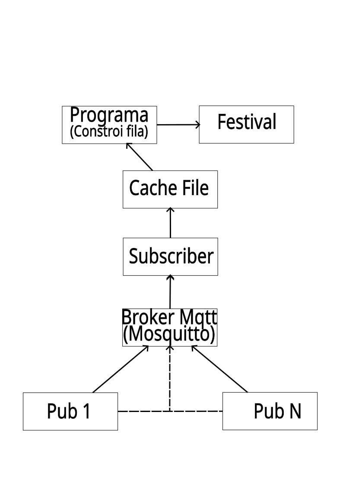

# Prova de conceito
Aqui está o projeto implementado em Python para a prova de conceito proposta no desafio seletivo. 
Para atender às demandas das especificações definidas, foi criado apenas um processo.
Ele é responsável por salvar os posts recebidos em uma fila. 
E outra thread instanciada será responsável por executar o festival.
O diagrama da arquitetura do projeto.

## Diagrama

## Especificações
No projeto foi utilizado as bibliotecas paho-mqtt e asyncio.
O projeto foi configurado hardcode, pois se trata de uma prova de conceito.
A porta utilizada será a 1883, e os post serão no tópico test/status.
